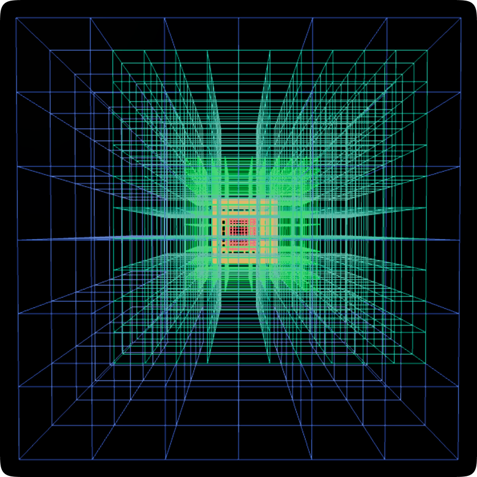

# Genesis
A procedural terrain generation library for Roblox.

## Features
- Optional SVO LOD support.
- Fast slab-based chunk loading that scales to large render distances.
- Adaptive budgeting that spreads chunk generation across frames to prevent lag.
- Target prediction for responsiveness, preloads chunks slightly ahead of the target position.

[Documentation](/packages/genesis/README.md)

## Subprojects
- **[Strata](/packages/strata/README.md)**: A Library for handling octree generation.
- **[Terra](/packages/terra/README.md)**: A collection of generators for Genesis.

### Utilities
- **[Pool](/packages/utils/pool/README.md)**: A generic object pool library.
- **[RingBuffer](/packages/utils/ringBuffer/README.md)**: A ring buffer library.
- **[EMeshQueue](/packages/utils/eMeshQueue/README.md)**: A first come, first serve queue for creating editable meshes.
- **[Poisson](/packages/utils/poisson/README.md)**: A 2D Poisson disc sampler with per-class radii and a parent/child hierarchy.
